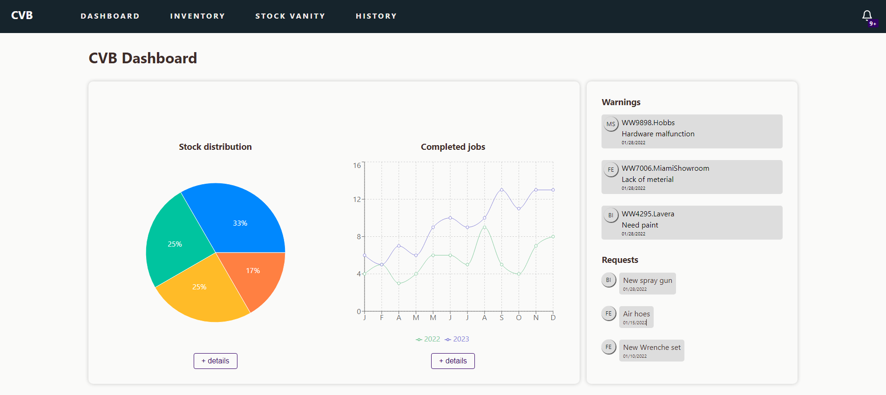

# Candlewood Valley Building

## CVB Workflow Process Optimizer            Organization in One Place

.png>)

Mussum Ipsum, cacilds vidis litro abertis. Cevadis im ampola pa arma uma pindureta.Tá deprimidis, eu conheço uma cachacis que pode alegrar sua vidis.Copo furadis é disculpa de bebadis, arcu quam euismod magna.Detraxit consequat et quo num tendi nada.

Mussum Ipsum, cacilds vidis litro abertis. Cevadis im ampola pa arma uma pindureta.Tá deprimidis, eu conheço uma cachacis que pode alegrar sua vidis.Copo furadis é disculpa de bebadis, arcu quam euismod magna.Detraxit consequat et quo num tendi nada.

### Features

* [x] Clients can see they job process (Like ordering a pizza)
* [x] Software will be responsive Segmentation of what peaple can do (Access Management)
* [x] Deshboard (Overall of things)
* [x] Job priority order (Most important jobs apear first)
* [x] Notifications tab for each user (user can see when is their time to take action on the job)&#x20;
* [x] Starring job
* [x] Page for active job and page for jobs done

### Benefits

#### Data Science

* [x] money spende per project
* [x] acurate time that the job started
* [x] wood spending track

#### Organization

* [x] Keep track of witch step the job is (overall for all jobs)
* [x] Help to make sure that the job wont go late

#### Faciliate decision making

* [x] Better undestanding of time and money aplied in each job

### FAQ

### Why i'm the best person to solve this problem

### MVP DASHBOARD
